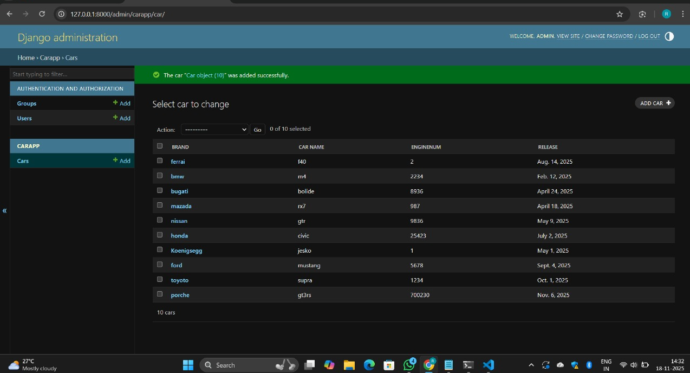

# EX01 Developing a Simple Webserver

# Date: 19.11.2025
# AIM:
To develop a simple webserver to serve html pages and display the configuration details of laptop.

# DESIGN STEPS:
## Step 1:
HTML content creation.

## Step 2:
Design of webserver workflow.

## Step 3:
Implementation using Python code.

## Step 4:
Serving the HTML pages.

## Step 5:
Testing the webserver.

# PROGRAM:
```
models.py
from django.db import models
from django.contrib import admin
class Car(models.Model):
    brand = models.CharField(max_length=10)
    car_name = models.CharField(max_length=10)
    enginenum = models.IntegerField()
    release = models.DateField()

class CarAdmin(admin.ModelAdmin):
    list_display=('brand', 'car_name', 'enginenum', 'release')
admin.py
from django.contrib import admin
from.models import Car,CarAdmin
admin.site.register(Car,CarAdmin)
```
# OUTPUT:
```

```
# RESULT:
The program for implementing simple webserver is executed successfully.
